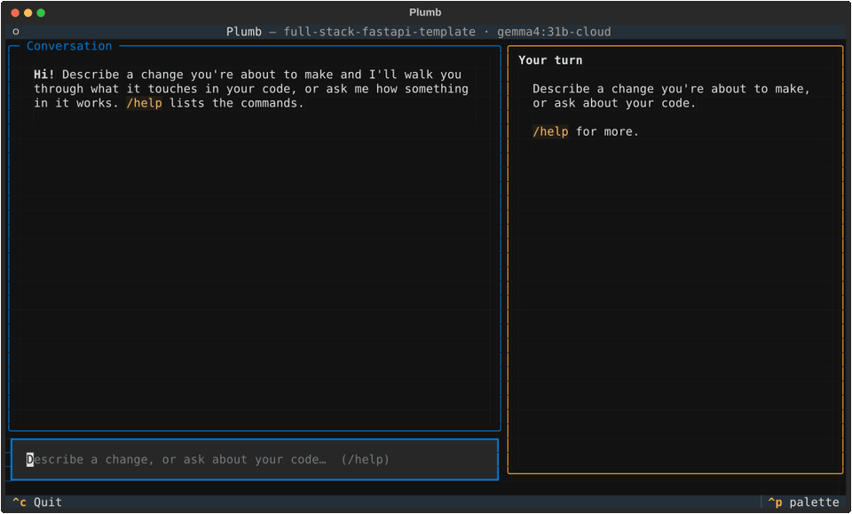

# Plumb



Plumb is a local-first tutor for **your own codebase**. Before you build a
feature, it walks you through what the change touches in your code and asks
you a few questions about the design choices. After you've built it, it
reviews what changed against what you decided. It can also give you a guided
tour of the repo, one file at a time.

It was built for one real person: a software-engineer friend who asked why
she should keep learning when an AI agent can write the code. Plumb's answer:
let the agent write code if you like, but stay the person who understands it.

- **Runs on your laptop.** An open-weight model (Gemma) served by Ollama.
  Your code stays on your machine.
- **Grounded in your files.** Every claim cites `file:lines`, and Plumb checks
  each citation against the real file before you see it.
- **Honest about the "why".** Every reason is labeled *documented* (a commit
  or doc said so), *inferred* (the model's reading) or *confirmed* (you agreed).
- **Never nags.** Skip any question; skipped topics come back at a calm moment.
- **Remembers, in plain files.** What you're solid or shaky on, your decisions,
  and every session live in `.tutor/` inside your project. Open, edit or delete them.

## Install

**Windows** (PowerShell):

```powershell
irm https://raw.githubusercontent.com/chestlyace/Plumb-cli/main/install.ps1 | iex
```

**macOS / Linux**:

```sh
curl -fsSL https://raw.githubusercontent.com/chestlyace/Plumb-cli/main/install.sh | sh
```

That installs [uv](https://docs.astral.sh/uv/) if needed, then Plumb. Open a
new terminal and run `tutor` in a project. The first run sets everything else
up:

1. **Ollama.** If it's missing, Plumb offers to install it (winget or the
   official installer on Windows) and starts it.
2. **The local model.** It recommends `gemma4:e2b` (4.6 GB) for 8 GB laptops
   and `gemma4:e4b` (6.6 GB) for more memory, then downloads your pick. If
   your Ollama is too old for Gemma 4, it offers to update it.
3. **A fallback**: a cloud model for when the local one fails, or none to
   stay fully local. A cloud model needs an ollama.com sign-in, which Plumb
   walks you through.

Run `tutor setup` any time to change these.

## Use

In any git repo:

```sh
tutor
```

That opens a chat. Then:

- **Describe a change** you're about to make ("add a CSV export for
  referrals"): Plumb explains what it touches, then asks 2-3 questions.
  Answer with the arrow keys or `1`-`3`, `?` for "I don't understand"
  (it explains with your own code and checks with one question), `s` to
  skip, `q` to skip the rest.
- **Ask a question** about your code ("how does a request get its DB
  session?") and get a cited answer, no quiz.
- `/review` after you've made the change: what changed, compared with your
  earlier decisions. `/review HEAD~1` reviews everything since a commit.
- `/tour` a guided tour from an entry point outward; it resumes where you left off.
- `/skipped`, `/help`, `/quit`. Esc cancels the current request.

`tutor plan "..."`, `tutor review` and `tutor tour` open the chat with that
first message. `--plain` gives the same chat as plain text.

## Settings

Setup writes `~/.config/plumb/config.toml`:

```toml
[model]
name = "gemma4:e4b"
endpoint = "http://localhost:11434/v1"
fallback_name = "gemma4:31b-cloud"   # "" to never fall back

[limits]
step_limit = 12
```

Any model Ollama serves works; change `name`. If the local model fails,
Plumb switches to `fallback_name` for the rest of the session and tells you.
A `:cloud` model runs on Ollama's servers, so the files it reads leave your
machine; set `fallback_name = ""` to stay fully local.

## How it works

- **Repo map** (`.tutor/repo-map.json`): files, functions and classes
  (tree-sitter), imports between files, git history and entry points,
  refreshed by file hash.
- **Read-only tools** the model calls: `read_file`, `grep`, `list_dir`,
  `git_log`, `repo_map`, `memory`. They can't write, and refuse anything
  outside the repo, ignored files and secrets like `.env`.
- **Small, narrow model calls** through PydanticAI: explore and explain,
  write questions, explain a concept. Guardrails: a step limit, one retry on
  invalid output, loop detection, and a fallback model.
- **Textual** for the chat; the engine never imports the UI.

## Develop

```sh
uv sync
uv run pytest
uv run ruff check
```

## License

MIT
